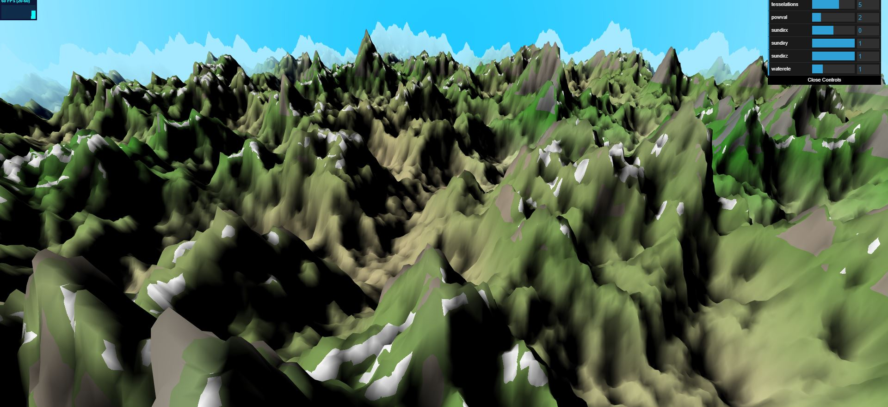
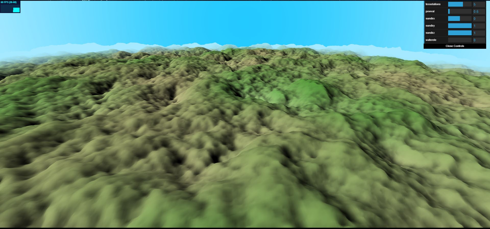
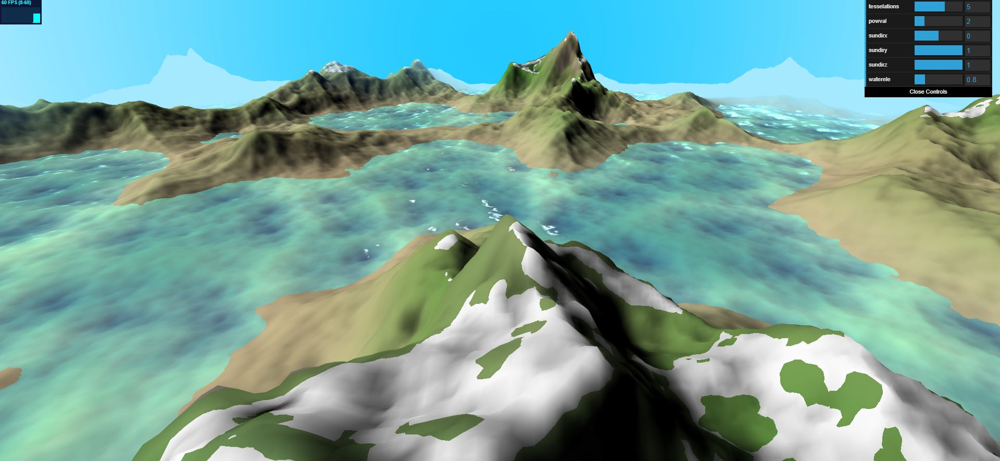
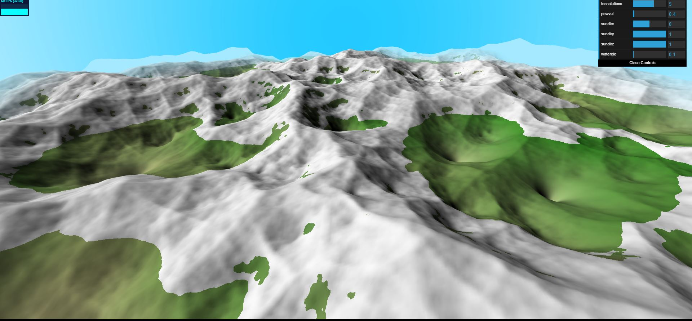
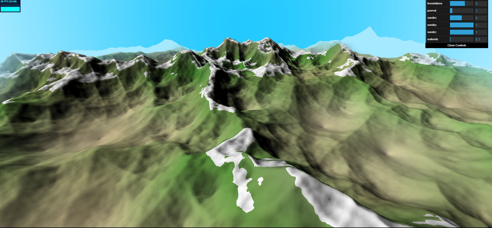
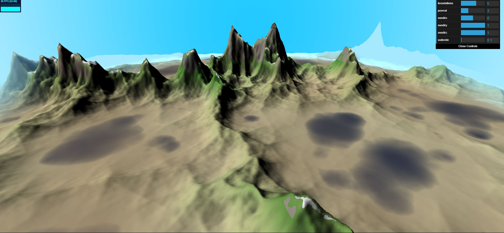
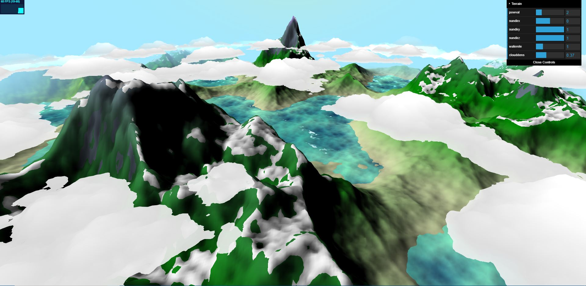

# CIS 566 Homework 1: Noisy Terrain

## [Demo]( https://lanlou123.github.io/hw01-noisy-terrain/)

## Current features:
- fbm combine worley noise terrain (two octaves of woley in the outter layer and 6 octaves of perlin noise together with one layer of large scale worley as mask in the outermost layer.
  - different noise comparision:
  
  pure worley fbm | pure perlin fbm 
  ----|---
   |  
  
  combine of two:
  
  

- biomes based on terrain altitude and a large scale fbm perlin noise
  - including grasslands forest and mud land , and also mapping of terrain color to it's altitude

- worley noise ocean (acheived by compositing multiple layers of worley noise in fbm style based on u_time,
each of which possess different velocity and direction)
- remapping of terrain:

pow 0.2 | pow 1.0 |pow 3.0
----|---|-------
 |  | 

- alpha blending based on depth of terrain for ocean
  - you can notice water transparency changes with it's elevation

- cloud using multiple octaves of worley noise, alpha blending based on thikness

- sun using raycasting in camera space......
- terrain color layers based on terrain hight as well as slope angle
- simple lambert shading for terrain
- specularity and fresnel effect for ocean surface

## GUI controls:

I only wrote a few controls which doesn't cover all features I've implemented
from top to bottom, they are:

- powval : the remapping degree of terrain based on pow function
- sundirx,y,z : three direction component for sun directions
- waterele : water elevation
- clouddens : coverage of clouds
- use W,A,S,D keys to move across the mountains and ocean
- use RMB to rotate camera, LMB to translate camera, MMB to zoom in and out..

## some other examples

