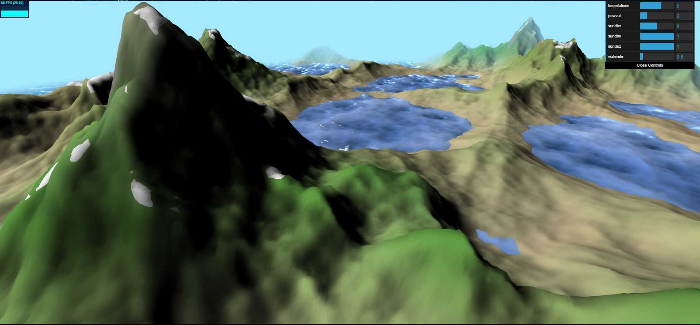

# CIS 566 Homework 1: Noisy Terrain

## Current features:
- fbm combine worley noise terrain (two octaves of woley in the outter layer and 6 octaves of perlin noise)
- worley noise ocean (acheived by compositing multiple layers of worley noise in fbm style,
each of which possess different velocity and direction)
- alpha blending based on depth of terrain for ocean
- terrain color layers based on terrain hight as well as slope angle
- simple lambert shading for terrain
- specularity and fresnel effect for ocean surface based on u_time

## some examples

